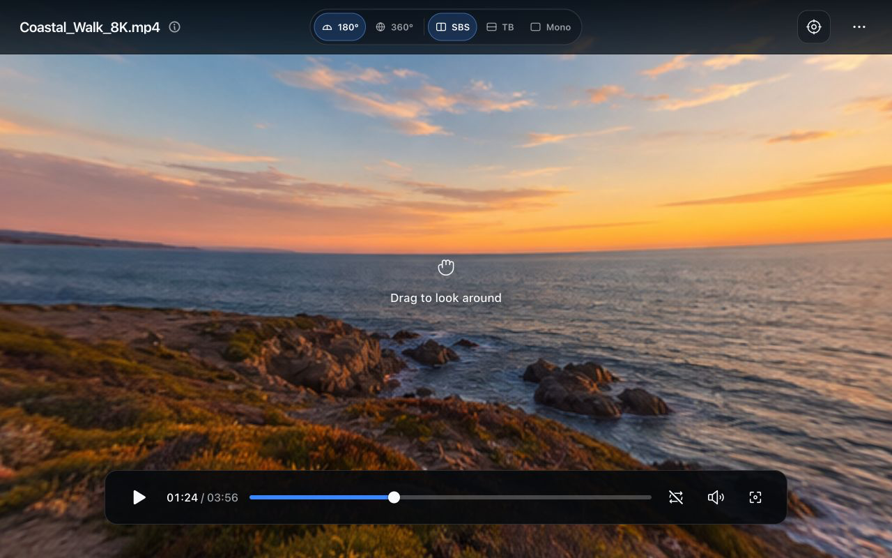

# Eagle | VR Player

An Eagle window plugin for previewing VR180 and VR360 video and still images on the desktop. Load the media selected in Eagle and drag the view to look around without putting on a headset.



## Features

- VR180 and VR360 projection modes
- Side-by-side (SBS), top/bottom (TB), and monoscopic media layouts
- Automatically loads the video or image currently selected in Eagle
- Still-image preview defaulting to VR180 and Mono, with playback, seek, and volume controls disabled
- Drag-and-drop support for opening another local video or image
- Starts video playback when the first view drag begins without resuming on later drags after a pause
- Optional loop playback from the transport controls
- View dragging during playback and mouse-wheel zoom
- Automatic format detection from Eagle tags
- Optional format-tag writing, disabled by default and remembered between sessions
- Focus mode for uninterrupted playback and view control
- Controls that fade out when the player is idle
- Reset-view feedback that fades out automatically

> [!NOTE]
> This player does not support stereoscopic rendering.

## Install for Development

1. Install dependencies:

   ```sh
   npm install
   ```

2. Build the plugin:

   ```sh
   npm run build
   ```

3. In Eagle, open **Plugins → Developer Options** and load the `dist` directory.
4. Select a video or image in Eagle and launch **VR Player**.

The build automatically includes `manifest.json` and the distributable `logo.png` in `dist`.

## Controls

| Action | Control |
| --- | --- |
| Look around | Drag the video |
| Zoom | Mouse wheel |
| Play / Pause | `Space` |
| Mute / Unmute | `M` |
| Toggle loop playback | `L` |
| Reset view | `R` |
| Seek backward / forward | `←` / `→` (5 seconds) |
| Enter focus mode | `F` |
| Exit focus mode | `Esc` |

The controls hide after approximately 0.5 seconds of inactivity during playback and 1.5 seconds while paused, stopped, or viewing an image. They return on pointer, touch, or keyboard input and remain visible while the pointer is over the top or playback controls.

## Format Tags

VR Player reads the following Eagle tags when an item loads:

```text
vr:projection=VR180
vr:projection=VR360
vr:mode=SBS
vr:mode=TB
vr:mode=Mono
```

Enable **Write format tags** under **More options** to synchronize the current projection and layout back to the selected Eagle item. This option is off by default.

## Local Preview

Run the development server to preview the interface with the bundled coastal panorama:

```sh
npm run dev
```

Open `/?media=image` on the development server to exercise the still-image state.
